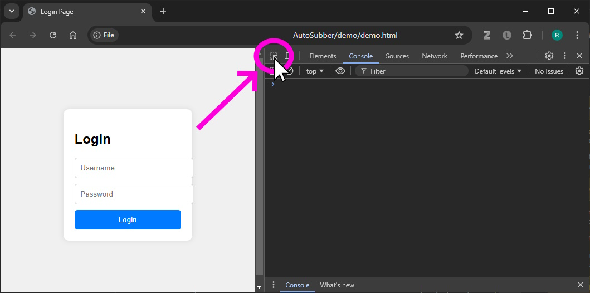
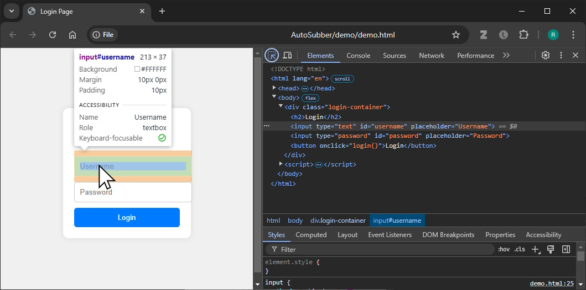
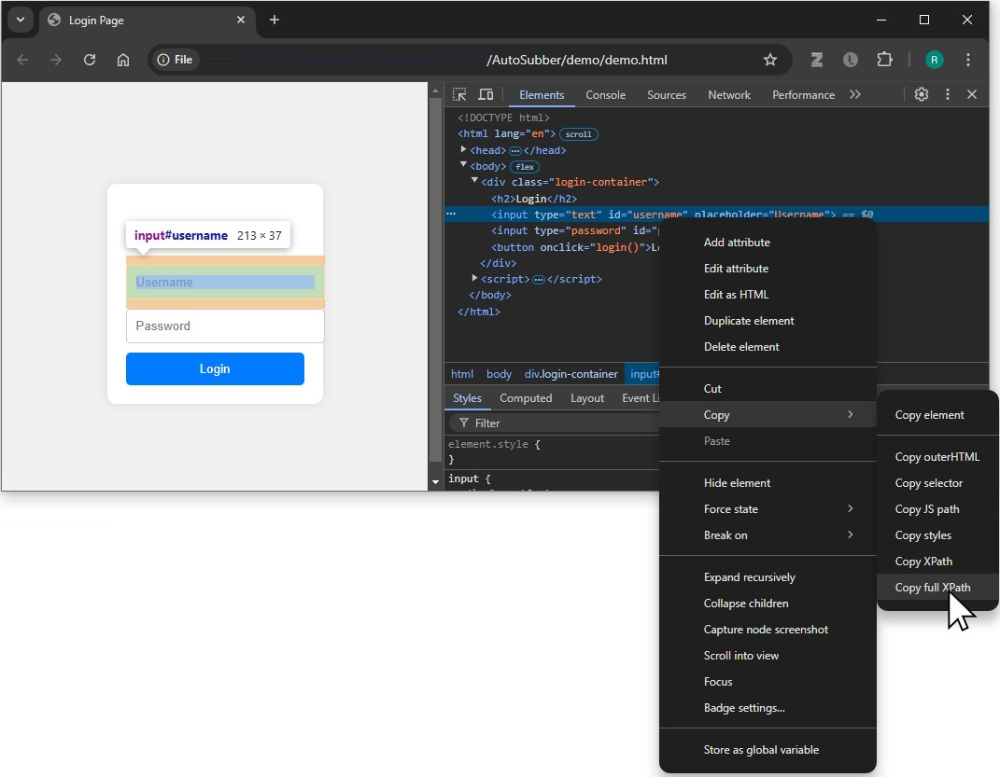

# AutoSubber


## Install 
Tested with python 3.11. Create a virtual env
```
py -3.11 -m venv venv
```
activate the venv, and install the required packages
```
pip install -e .
```


## How to Use

Write a subscriber for a webpage you want to automatically navigate. Then schedule automatic running of the subscriber using the scheduler. 
See the demo folder for a demo subcriber and scheduler.

Define a trigger that says when to run the task (every day_of_week/hour/minute/second)
See https://apscheduler.readthedocs.io/en/3.x/modules/triggers/cron.html#module-apscheduler.triggers.cron for details on the trigger definition. 

```python
from autosubber.scheduler import Scheduler, Trigger
from demo import subscribe

# setup trigger, day/time/seconds...
trigger = Trigger(second="00/15")
scheduler = Scheduler(trigger, subscribe)
scheduler.run()

print(
    "Scheduler stopped. Exiting program. Were we successful: ",
    scheduler.success,
)
```


## Credentials 

Save credentials using the credential manager. Passwords are stored in encoded format `credentials.json`, and protected with a Fernet cypher. 

To save new credentials, run the credential manager from the terminal, and go through the prompts:
```
python .\autosubber\credentialmanager.py
```
## How to create a subscriber

Open a webpage you want to browse automatically, and press F12 to open the developer console in the browser. In this example, we open `demo.html`



Then click an element you need to interact with:



Go to the "Elements pane", right click the element, and select "copy full XPath":



Create a python file, and create a function `subscriber` (see `demo.py` for full version)

First open a webdriver, and get it to load the URL you need. 
```python
driver = webdriver.Chrome()
driver.implicitly_wait(10)
driver.get(DEMO_PAGE_URL)
```

Find the XPaths of all elements you need to interact with. Then you can write the code to automate the interaction
```python
XPATH_USERNAME = r'/html/body/div/input[1]' 
XPATH_PASSWORD = r'/html/body/div/input[2]' 
XPATH_BUTTON = r'/html/body/div/button'

# fill in the form
input_username = driver.find_element(By.XPATH, value=XPATH_USERNAME)
input_username.clear()  # clears the current contents
input_username.send_keys(username)  # types the username

input_password = driver.find_element(By.XPATH, value=XPATH_PASSWORD)
input_password.clear()
input_password.send_keys(password)

# click the button
driver.find_element(By.XPATH, value=XPATH_BUTTON).click()
```
Now we can check if the login was successful by reading an element in the page, or the titlebar.
```python
XPATH_PROMPT = r"/html/body/div[2]"
# check if login was successful. if successful, the webpage titlebar will display "Success"
time.sleep(1)
msg_box = driver.find_element(By.XPATH, value=XPATH_PROMPT)
```

Finally, make some logic to determine if the whole subsriber process was successful. If it was, return `True` from the subscribe function. This is used by the scheduler to mark the task done.
```python
msg_box = driver.find_element(By.XPATH, value=XPATH_PROMPT)

task_success = False
if "Login Success" in msg_box.text:
    task_success = True
    print("Login Success!")
else:
    print("Login failed")

```


